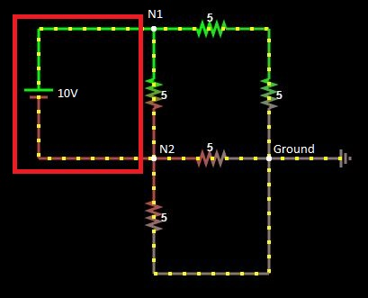
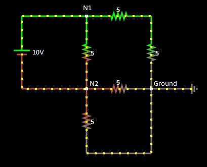

Documentation
=============

## Problem #1
> If your finger touches your hand, does your hand feel your finger first, or the other way round?

Assuming the following code:
```javascript
var batt = new Battery(),
    wire = new Wire();
      
batt.P.to(wire.A); // battery's 'Positive' end connect-to wire's 'A' end
// in the reality, this should have the same effects as "wire.A.to(batt.P)"
```
In other words, when one end of a wire is placed on top of the battery's end, which one should be "connected" to the other? Which one should change the state of the other, or both?

### Solution: 
Instead of one end connecting to the other, we have a middle-person to handle the connections - a slot, or position of a grid.
Now, the code would look something more like this (assuming there's a grid object that "owns" the coordinates)
```javascript
var batt = new Battery(),
    wire = new Wire();
    
batt.P.to(1,1); // to(x,y) - coordinates of a grid or board
wire.A.to(1,1);
```
If you think about it now, the grid object can then store / manipulate the states for both the components to interact with!

<br>
## Problem #2
Now that I know how components can 'connect', I still don't know how to put a lot of things together
i.e. how are we going to calculate the voltage, conductance, etc? The major obstacle I have for this project is my lack of (or almost negligible) experience
and understanding in the field of electrical / electronic. The good thing is that there are tons of resources online such as the conceptual
way of how circuit sims work (see Resources Section, too lazy to reference anything at this point).

### Solution:

After doing some reading, I realised that there are just a *whole lot* more than Ohm's Law and Kirchhoff's Law to developing a complete circuit sim.
One of the things for me to learn is **Nodal Analysis** + Gaussian Elimination (to solve the system of linear equations from it). However, Nodal Analysis
will not be enough since it's just for DC Analysis only. Either way, this is still a good start for me to take on this project.

<br>
## Problem #3
> _"Ground control to Major Tom..."_

As I am trying to make Nodal Analysis the one method to rule them all (KCL & KVL) for DC analysis, I have found myself to be in a pickle. One of the steps of Nodal Analysis is to choose a reference node and mark the node voltage to 0, and we can then calculate the other nodes' voltages with reference to it i.e., we have to 'make' a node the _ground_ of the circuit. Which leads to the problem - how should I decide where the ground should be? If a different node is chosen as a ground, wouldn't that give a different result? What would be the criteria for a node to be best suited as the ground?

## Solution:
So how am I to decide what is the best / ideal place for a ground? Answer, I don't. As I am not aiming to write a software that provides advice or to decide the best solution for the user, what I can do is to leave that responsibility to the user him/herself. In other words, the user will decide and add the ground 'component' onto the circuit.

> _Create tools to not show what things should be, but what things can be! Unless it's a code linter._

Main take away: Remind yourself of the reason for doing the project, and what it is for.

<br>
## Problem #4
While I was practising Nodal Analysis with various simple circuits, I came across a challenge - how do I write the KCL equation for a node with a branch that only has a voltage source i.e. a V-branch? Since the branch does not have (significant) resistance, how am I going to calculate the current in that branch?

<center>

<br>
_Highlighted in red: V-Branch a.k.a. evil branch as said by L.R.Linares_
</center>

The easiest way is to place the ground component at the negative end of the source, but remember, for the solution to Problem #3 we are giving the user the freedom to place the ground anywhere.

Assuming the following circuit is what I am trying to solve:
<center>

</center>

KCL for Node 1: 
<pre>
    -I + (V<sub>1</sub>-V<sub>2</sub>)/5 + (V<sub>1</sub>)/10   = 0
    3V<sub>1</sub> - 2V<sub>2</sub> - 10I            = 0 // equation #1
</pre>
KCL for Node 2:
<pre>
    I + (V<sub>2</sub>-V<sub>1</sub>)/5 + 2(V<sub>2</sub>/5)    = 0
    -V<sub>1</sub> + 3V<sub>2</sub> + 5I             = 0 // equation #2
</pre> 

So now, I have three variables V<sub>1</sub>, V<sub>2</sub> and `I` to solve but only 2 equations... *sadFace.jpg*.<center></center>

## Solution:
Turns out this could be easily solved by introducing a simple equation for the V-branch:

<center><pre>V<sub>+</sub> = V<sub>-</sub> + V<sub>source</sub></pre></center>

Explanation: `Voltage at positive end = Voltage at negative end + Voltage of source`
 
And that's it! What I have now is the equation V<sub>1</sub> = V<sub>2</sub> + 10V, and I just have to sub that into equations #1 and #2 then we'll be left with only two variables for two equations!

<pre>
Equation #1
3V<sub>1</sub> - 2V<sub>2</sub> - 10I         = 0
3(V<sub>2</sub> + 10V) - 2V<sub>2</sub> - 10I = 0
V<sub>2</sub> - 10I                = -30V

Equation #2
-V<sub>1</sub> + 3V<sub>2</sub> + 5I           = 0
-(V<sub>2</sub> + 10V)> + 3V<sub>2</sub> + 5I  = 0
2V<sub>2</sub> + 5I                 = 10V
</pre>

After substitution / Gaussian elimination, we get V<sub>2</sub> = -2V and `I` = 2.8A.
With that, we can continue solving for V<sub>1</sub> and the rest of the circuit. Big thanks to L.R.Linares' video on Modified Nodal Analysis that provided me with the V-branch equation, the key to solving this problem. 

<br>
___

## Resources

1. [How do Circuit Simulators actually work?](https://electronics.stackexchange.com/questions/91416/how-do-circuit-simulators-actually-work/91437#91437?newreg=6cdfc012e3d74ac08ddb38d4c5ca9844)
2. [SPICE ALGORITHM OVERVIEW](http://www.ecircuitcenter.com/SpiceTopics/Overview/Overview.htm)
3. [Nodal Analysis](http://mathonweb.com/help/backgd5.htm)
4. [Youtube - Types of Branches by L.R.Linares](https://www.youtube.com/watch?v=MczLK6143kg)
5. [Youtube - Modified Nodal Analysis by L.R.Linares](https://www.youtube.com/watch?v=UGwwX4joijY)

## Other Circuit Sims (or the like)

1. [Falstad's](http://www.falstad.com/circuit)
2. [EveryCircuit](http://everycircuit.com/)
3. [DC/ACLab](http://dcaclab.com/en/home)
4. [Krets](https://github.com/hraberg/krets) - Has load of external links too
5. [Adobe 123D Circuits](https://123d.circuits.io/) - Nice graphics + Programmable Arduino = Mind blown
6. [Thom Wright's Circuit Sim](https://github.com/circuitsim/circuit-simulator) - pretty cool, pretty UI
7. [Kazuhiko Arase's Circuit Sim](https://kazuhikoarase.github.io/simcirjs/) - Another cool HTML5/JS circuit sim
